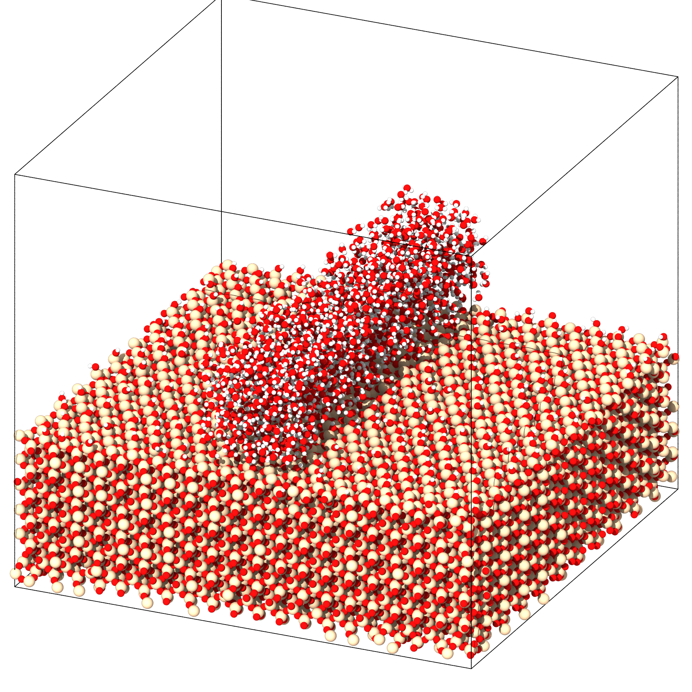

# Interface Builder 

  

This package facilitates the automated generation of silica-water interfaces, offering diverse options for creating silica surfaces, silica systems, and silica-water systems.

Its primary objective is to streamline the process of generating specific interface geometries and surfaces with predefined silanol concentrations.

Key features include:

- Systematized preparation of silica surfaces.
- Fully automated temperature-quench approach with customizable parameters.
- Automated passivation and adjustment of silanol concentration to user-defined levels.
- Capability to add water onto surfaces of specified shapes and dimensions.
- Flexibility to rearrange different approaches to silica preparation, such as minimization followed by annealing, annealing without prior minimization, or a combined minimization and thermalization step. This versatility eliminates the need to repeatedly script each approach, allowing users to execute them with a single line of code while specifying desired specifications.
