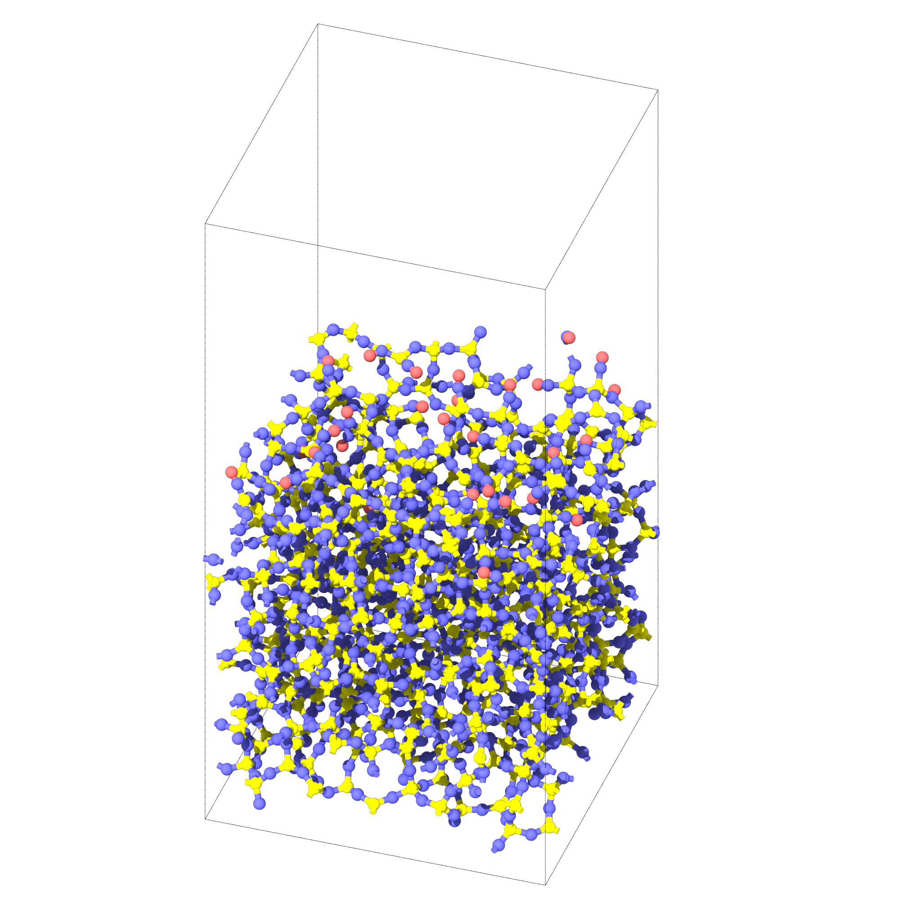
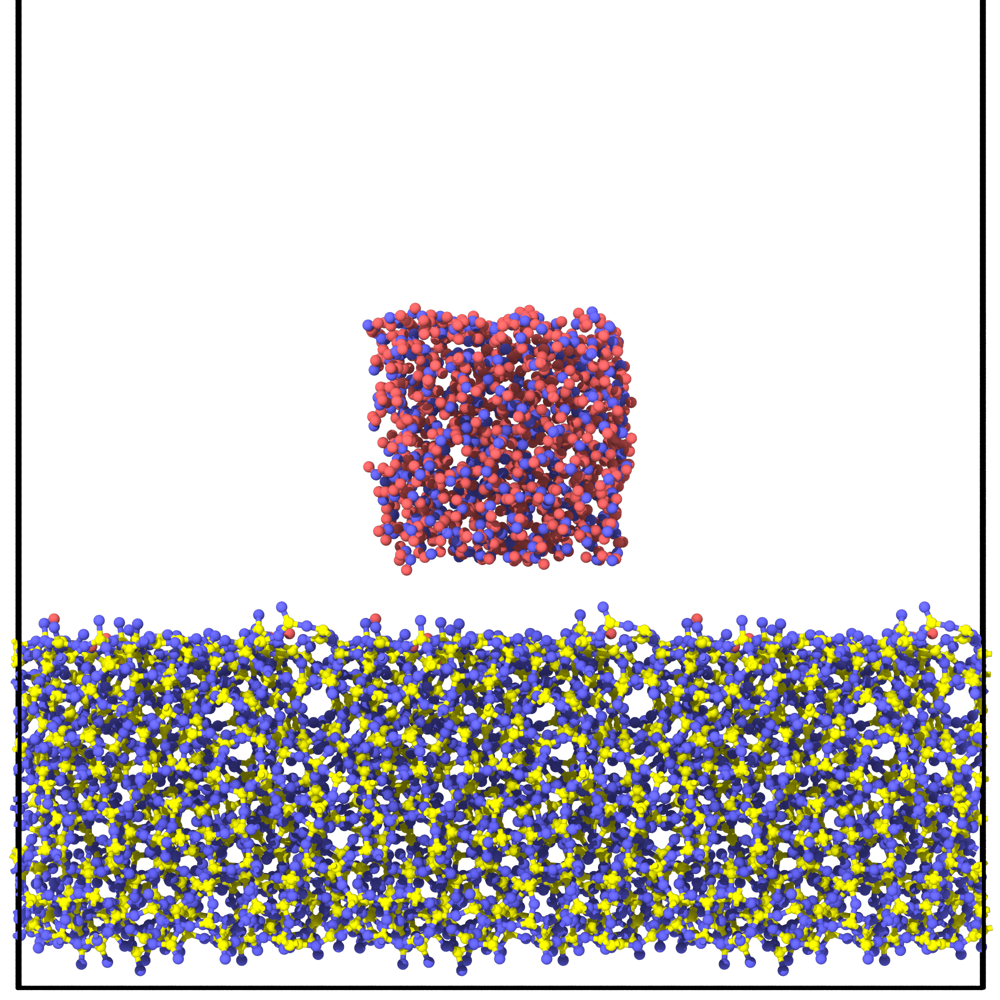

# Interface Builder 

## Generating passivated silica surface




```python
from interface_builder import Silica

# 4 --> 28.48x28.48x28.48
silica_params = {
    'lx' : 4, 
    'ly' : 4, 
    'lz' : 4, 
    'vacuum' : 30,
    'filename' : 'silica_amorphous.data',
    'output_folder' : f'./annealed_T300K/amorphous_passivated_{indx}',
    'input_folder' : None, 
    'sio2_potential' : './data/SiO2.vashishta',
    'sio2_h2o_potential' : "./data/SiOH2O_199_16_adjusted.vashishta",
    'h2o_potential' : './data/potential_nm_0_0.mod'
}

# initilize the silica system
silica = Silica(**silica_params)

# Replicate [lx,ly,lz], then do initial annealing
silica_file = silica.build_amorphous(16, "lmp", run=True)
silica_surface = silica.add_vacuum(silica_file, "silica_surface+vacuum.data")

silica_relax = silica.thermalize(silica_surface, time=200, temp=300,
                                output_filename="amorphous_surface_thermalized-300.data",
                                mpirun_n=16, lmp_exec="lmp", run=True)
minimized_silica = silica.minimize_sio2(silica_relax, mpirun_n=16, lmp_exec="lmp", run=True)

passivated_silica = minimized_silica 
# Recursively passivate the system 
for _ in range(1):
    passivated_silica = silica.passivate(passivated_silica, 5, 'passivated_silica.data',
                                        water_thickness=5, mpirun_n=1, lmp_exec='lmp_usc', run=True)

# Shift the origin of silica by 2 angstrom, to avoid dangling atom on the ceiling of the cell. 
shifted_z_silica  = silica.shift_z_origin(passivated_silica, 2, "silica_shifted_z.data")
silica.resize_z(shifted_z_silica, 90)
```


## Generate surface for heat of immersion calculation 
```python 
from interface_builder import Silica

silica_params = {
    'lx' : 3, 
    'ly' : 3, 
    'lz' : 3, 
    'filename' : 'silica_amorphous.data',
    'output_folder' : f'heatofimmersion5',
    'sio2_potential' : 'SiO2.vashishta',
    'sio2_h2o_potential' : "potential_hoga_0_0.mod",
    'h2o_potential' : "potential_nm_0_0.mod", 
}

# initilize the silica system 
silica = Silica(**silica_params)

# replicate [lx,ly,lz], then do initial annealing
silica_file = silica.build_amorphous(16, "lmp", run=False)


N = int(586/2)   # number of water, N water molecule on both sides 
dH_imm = silica.get_heat_of_immersion(silica_file, 
                                      num_h2o=N, 
                                      h2o_therm_time=20,
                                      sio2_therm_time=100,
                                      output_filename="water-silica_system.data",
                                      mpirun_n=16,
                                      run=True
                                      )
print("Calculated heat of immersion:", dH_imm, "J/m^2")
```


## Generating system for water contact angle simulation 




```python 
from interface_builder import Silica

silica_params = {
    'lx' : 4, 
    'ly' : 4, 
    'lz' : 4, 
    'vacuum' : 30,
    'filename' : 'silica_amorphous.data',
    'output_folder' : 'contact_angle_folder',
    'input_folder' : None, 
    'sio2_potential' : './data/SiO2.vashishta',
    'sio2_h2o_potential' : "./data/potential_SiO2H2O_mod", 
    'h2o_potential' : "./data/potential_H2O.mod" 
}
# ======= INITIALIZATION OF THE SILICA SYSTEM ==================== 
# initilize the silica system
silica = Silica(**silica_params)

# Replicate [lx,ly,lz], then do initial annealing
silica_file = silica.build_amorphous(16, "lmp", run=True)
silica_surface = silica.add_vacuum(silica_file, "silica_surface+vacuum.data")

silica_relax = silica.thermalize(silica_surface, time=300, temp=300,
                                output_filename="amorphous_surface_thermalized-300.data",
                                mpirun_n=16, lmp_exec="lmp", run=True)
minimized_silica = silica.minimize_sio2(silica_relax, mpirun_n=16, lmp_exec="lmp", run=True)

# ======= PASSIVATION OF THE SILICA SYSTEM ========================  
passivated_silica = minimized_silica 
Recursively passivate the system until all the dangling atoms are passivated.
for _ in range(3):
    passivated_silica = silica.passivate(passivated_silica, 10, 'passivated_silica.data',
                                        water_thickness=5, mpirun_n=1, lmp_exec='lmp_usc', run=True)

# Aesthetics : Shift the origin of silica by 2 angstrom, to avoid dangling atom on the ceiling of the cell. 
shifted_z_silica  = silica.shift_z_origin(passivated_silica, 2, "silica_shifted_z.data")
silica.resize_z(shifted_z_silica, 90)

# Replicate the system 1x3x1 
silica_replicated = silica.replicate([1,3,1],shifted_z_silica,"silica_replicated.data", run=True)

# ======= WATER + SILICA SYSTEM ==================================
print("Defects O, Si : ", silica.get_coordination(minimized_silica))
print(f"{indx}. Silanol concentration = ", silica.get_silanol("silica_replicated.data")) 


h2o_silica_system = silica.add_water(silica_replicated, [None,20,20], 
                                    num_mol=512,
                                    thermalized_h2o=1, 
                                    output_filename="silica_water-final.data",
                                    mpirun_n=16,
                                    run=True)
```